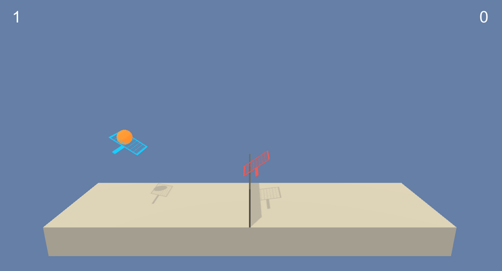
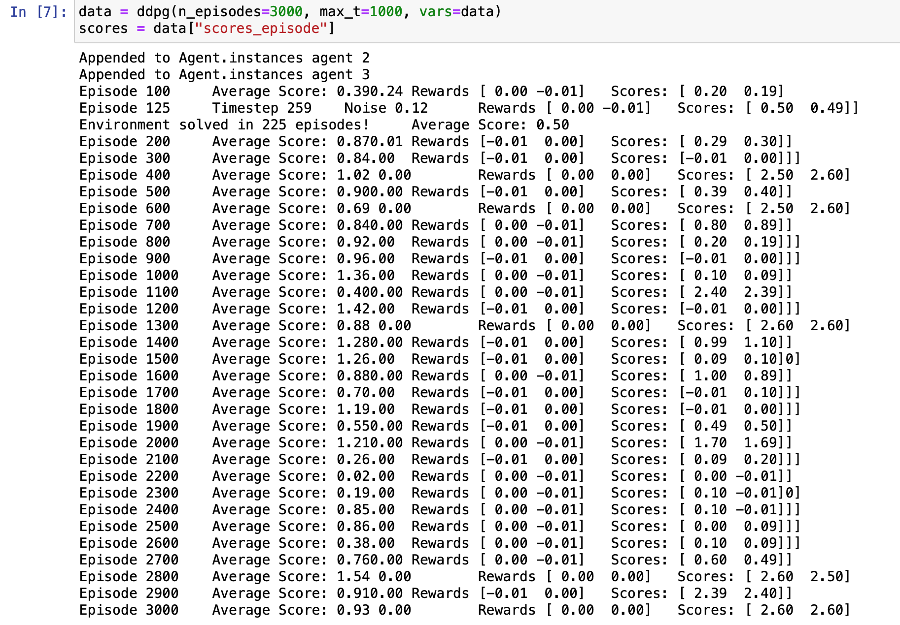
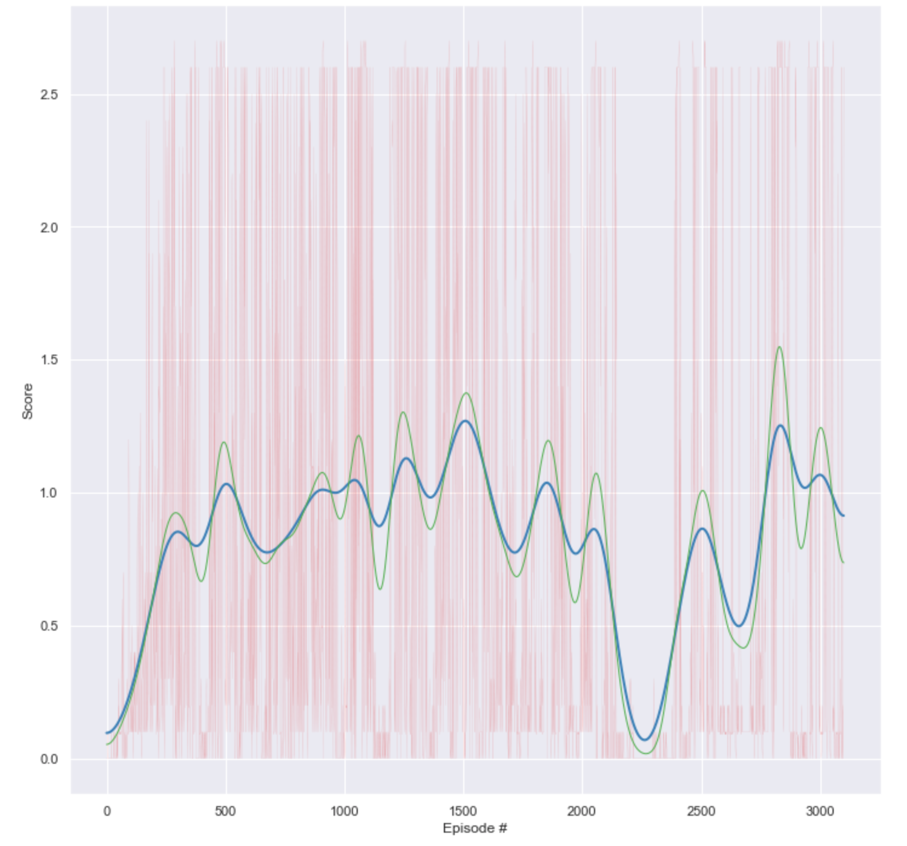

## Collaboration and competition Report

 )

## Goal
Goal of this project is to solve using DDPG (Deep Deterministic Policy Gradient) environment with game of tennis. Two learning agents, represented by rackets, hit a ball back and forth between each other over a net. The game is two dimensions only as the agents can only move towards or away from the net, as well as jump up. The ball and both players are always in the same vertical plane orthogonal to the net. During one episode of play, an agent earns a reward of +0.1 every time it hits the ball over the net. A negative reward of -0.01 is given if the ball hits the ground or goes out of bounds. Ideally, the two agents should learn how to keep the ball in play to earn a high total reward. Which is based in the [DDPG-Bipedal Udacity project repo](https://github.com/udacity/deep-reinforcement-learning/tree/master/ddpg-bipedal).

## State Space
The introduction to the course project indicates the state space consists of 8 variables corresponding to the position and velocity of the ball and racket. Each agent receives its own, local observation. On examination of the environment, it indicates that it's state size is 24 for each agent, so there must be other parameters in the state space.

## Action Space
The action space consists of two possible continuous actions, corresponding to movement towards (or away from) the net and jumping.

## Specified Project Goal
The environment is episodic. Each agent earns a score in one episode and the episode is then characterized by the maximum score between the agents. The maximum score between the two agents during one episode is average over 100 consecutive episodes. This 100-episode average of the maximum agent score must exceed +0.5 in order for the environment to be considered solved.

For each time step and agent the Agent acts upon the state utilising a shared (at class level) `replay_buffer`, `critic_local`, `criticl_target` and `critic_optimizer` networks  with local `actor_local`, `actor_target`, `actor_optimizer` networks.

### DDPG Hyper Parameters
- n_episodes (int): maximum number of training episodes
- max_t (int): maximum number of timesteps per episode (increase for exploring more states)
- num_agents: number of agents in the environment

### DDPG Agent Hyper Parameters

- BUFFER_SIZE (int): replay buffer size
- BATCH_SIZE (int): mini batch size
- GAMMA (float): discount factor
- TAU (float): for soft update of target parameters
- LR_ACTOR (float): learning rate for optimizer
- LR_CRITIC (float): learning rate for optimizer
- WEIGHT_DECAY (float): L2 weight decay
- N_LEARN_UPDATES (int): number of learning updates
- N_TIME_STEPS (int): every n time step do update

Where 
`BUFFER_SIZE = int(1e5)`, `BATCH_SIZE = 256`, `GAMMA = 0.99`, `TAU = 1e-2`, `LR_ACTOR = 1e-3`, `LR_CRITIC = 1e-3`, `WEIGHT_DECAY = 0.0`, `N_LEARN_UPDATES = 6` and `N_TIME_STEPS = 6`

In addition the Ornstein-Uhlenbeck OUNoise `scale` was defaulted to `0.1`. Amplitude of OU Noise occurred starting at `2` reducing by `0.9999` each time step. 

### Neural Networks

Actor and Critic network models were defined in [`ddpg_model.py`](https://github.com/doctorcorral/DRLND-p3-collabcomp/blob/master/ddpg_model.py).

The Actor networks utilised two fully connected layers with 256 and 128 units with relu activation and tanh activation for the action space. The network has an initial dimension the same as the state size.

The Critic networks utilised two fully connected layers with 256 and 128 units with leaky_relu activation. The critic network has  an initial dimension the size of the state size plus action size.

## Plot of rewards

## Ideas for Future Work
Should experiment similar model using stock data.
